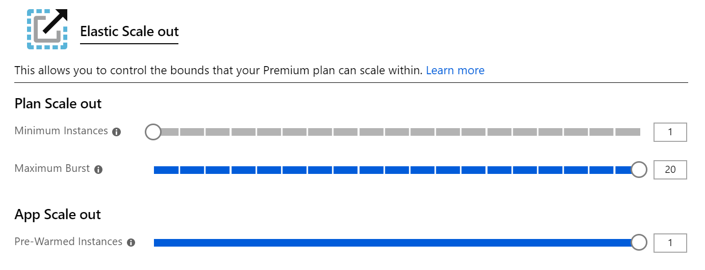

# Producer / Consumer Pattern Using Azure Service Bus and Azure Functions
## Cost Optimization Considerations
Cost in Azure accrues over time based on the services that are used within your solution. In most cases there are a large number of meters that need to be accounted for if you're looking to draw a comprehensive pictures of cost. Generally however the vast majority of overall cost will come a smaller number of core services that are in use. This being said, with this solution we'll focus on service bus, functions and networking costs as they will constitute the majority of your spend.
### Service Bus
As previously mentioned, Service Bus Namespaces can be provisioned in one of three tiers ( Basic, Standard and Premium). For details on how these tiers are priced please see the following [pricing document](https://azure.microsoft.com/en-us/pricing/details/service-bus/?&OCID=AID2100131_SEM_XoKIJQAAAFvOgjyo:20200722185658:s&msclkid=525e7aa4c0e71f13cee325bc4b11ecf8&ef_id=XoKIJQAAAFvOgjyo:20200722185658:s&dclid=CNyPsu_E4eoCFYg_DAodvM8HkA).

Requirements dictate that we use Premium Namespaces in this solution. The primary unit of scale for Premium Namespaces is the Messaging Unit (MU). Billing is based on how many messaging units (1,2,4 or 8) you run per namespace per hour. The cost is linear per MU. Current rates can be found in the above linked pricing document.

In general, you'll want to be sure that you're running only as many messaging units in your namespace as your performance and scale requirements dictate. It's difficult to discern the number of MUs you will require without conducting some initial scale testing. We generally recommend you start with one or two MUs, test and scale accordingly. See [Performance and Scalability considerations](#Performance-and-Scalability-considerations) for more information.

### Functions
There's a great article [here](https://docs.microsoft.com/en-us/azure/azure-functions/functions-scale) that describes the hosting options for Azure functions. In a nutshell, you can run functions in a Comsumption Plan, Premium Plan or an App Service Plan.  
  
Requirements for this solution dictate that we use either the Premium Plan or App Service plan as these support the networking integration functionality we need.

Premium Plan is recommended due to the fact that it supports automatic dynamic scaling with a [high scale out limit](https://docs.microsoft.com/en-us/azure/azure-functions/functions-premium-plan#region-max-scale-out). When using an App Service Plan you need to manually [configure auto-scaling](https://docs.microsoft.com/en-us/azure/app-service/manage-scale-up) within the confines of the specific plan you've selected.

Billing for the Premium plan is based on the number of instances of a given app plan size that are active per hour. At least one instance must be warm at all times per plan. This means that there's a minimum monthly cost per active plan, regardless of the number of executions.

When provisioning a premium plan, you first need to select a [plan size](https://docs.microsoft.com/en-us/azure/azure-functions/functions-premium-plan#available-instance-skus) EP1, EP2 or EP3. This defines the instance size that your plan will scale at when it scales in and out. It also dictates the base cost that will be charged per instance as you scale. Your plan will initially be set with a "minimum instance" setting of 1. It's possible to adjust this upwards to accommodate what you know to be baseline load. You will however incur the full cost of additional instances at the plan size if you do so.

It is also possible to adjust the Maximum instance burst ceiling on the plan such that the plan will never burst beyond the defined number of instances. Setting this ceiling can contain cost but it does so by potentially placing a limit on the scale of your apps.

A premium plan can have one or more function apps attached to it. At the function app level you can select the number of [pre-warmed instances](https://docs.microsoft.com/en-us/azure/azure-functions/functions-premium-plan#pre-warmed-instances) you want to run. This number cannot exceed the "minimum instance" level set at the plan level. This functionality is designed to avoid what are commonly referred to as cold starts. Adjusting this setting upward will cause you to be charged for the number of pre-warmed instances on an ongoing basis.	

Below is a snippet of the scale adjustment sliders in the portal. This is from the app level scale settings and shows both app and plan scaling parameters:  

 

### Networking